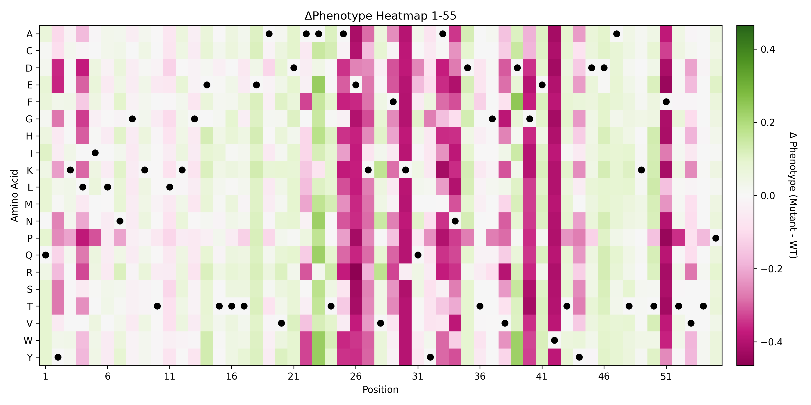

# SEQLite 🧬

## 📌 Overview

Identifying key patterns or critical positions within biological sequences (such as proteins) is a cornerstone of biological research. Currently, this process heavily relies on the experience of human experts—making it highly subjective, time-consuming, and expensive. On the other hand, mainstream AI for Science (AI4Bio) models demand massive computational resources, which are often unaffordable or unnecessary for traditional wet labs.

SEQLite is a lightweight, plug-and-play plugin designed for protein sequence pattern recognition. Built to run efficiently on a standard personal computer, SEQLite democratizes machine learning for biology.

**Key Features**

- Lightweight & Accessible: No GPU clusters required; runs smoothly on local machines.
- Versatile Model Integration: Packed with both classic machine learning and deep learning architectures, including MLP, CNN, ResNet, and XGBoost.
- Flexible Encoding: Supports two mainstream amino acid encoding methods: One-hot and VHSE (Physicochemical properties vectors).

## 📊 Data Preparation

SEQLite accepts both .csv and .fasta (.fa) file formats. To ensure smooth execution, please format your data as follows:

1. CSV Format (.csv)
   The file must contain exactly two columns:
   - x: The protein sequences.
   - y: The corresponding phenotype values (labels).

        |x|y|
        |---|---|
        |sequence1|phenotype1|
        |sequence2|phenotype2|

1. FASTA Format (.fasta / .fa)
   Each sequence header must include the phenotype value designated by ```label=``` immediately following the sequence ID (with no spaces).
   
```
>seq1 label=1.000
AAAAAAAATTTTTTTTTCCCCCCGGGG
>seq2 label=0.452
AAAAAAAATTTTTTTTTCCCCCCGGGA
```

## 🚀 Quick Start

Get SEQLite up and running in three simple steps:
1. **Install Dependencies** Run the setup script to install all required packages before your first run:
```Bash
bash setup.sh
```
2. **Launch the Backend** Navigate to the source directory and start the application:
```Bash
cd src
python app.py
```
3. Open the GUI Open ```index.html``` in your favorite web browser to interact with SEQLite through a user-friendly graphical interface.

## 📈 Results & Visualizations
Once a model finishes training, SEQLite automatically performs an in silico saturation mutagenesis simulation.

The system takes the wild-type sequence and systematically substitutes every single position with all possible amino acids, one at a time. These mutated sequences are fed into the trained model to predict their phenotype values.

The final output is a Heatmap that maps out the impact of every mutation at every position, spotlighting crucial sequence patterns and functional hotspots.

⚠️ Note: Visualizations will be displayed directly in the GUI and saved automatically to your local directory. Please note that the trained model weights are temporary and will not be saved.

## Example: GB1 Domain Analysis

The GB1 (Streptococcal protein G B1 domain) is a small, highly stable protein domain widely used in protein engineering.In this benchmark, we randomly sampled 2,000 sequences (```test.csv```) from a massive dataset containing ~500,000 sequence-phenotype mappings to train an XGBoost model. As shown below, the deeper-colored rows/columns highlight key functional positions that closely match empirical data from biophysical wet-lab experiments.



